# 激光资源包

该资源包包含激光相关的物品，供 Ballex² 和 BME pro HDRP 使用。

[-235?style=flat>)](https://store.steampowered.com/app/1809190/)

[English](README.md) | 简体中文

> [!IMPORTANT]
> 该资源包目前还未上传。当更多性能测试完成，且 `打包资源` 功能可用时，该资源包将会发布。

## 使用方法

### 安装

点击菜单栏的 `文件 → 解包资源` 以安装该资源包，然后重启 BME。

### 启用激光

点击菜单栏的 `脚本 → 启用激光` 以在当前场景中启用激光系统。

### 标签

标签仅对非链接元件有效。

-   `AffectedByLaserForce`: 仅具有此标签的 **刚体** 元件才会受到激光力的影响。
-   `ReflectLaser`: 拥有此标签的元件可以反射激光。
-   `IgnoreLaser`: 拥有此标签的元件会被激光忽略。

> [!WARNING]
> 激光系统已经占用了 `variables` 模块中的 `LaserInstances` 变量名。
> **请勿** 在自己的脚本中使用此变量名，也**不要**调用 `variables.clear()`。

## 元件

### 球类

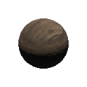
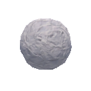
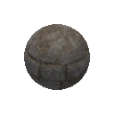
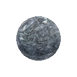
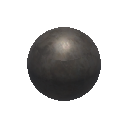
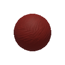
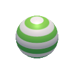
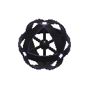
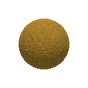

和官方球类相同，但可以受到激光力的影响。`钢球` 还会反射激光。

### 箱子

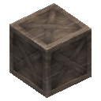

和官方箱子相同，但受到激光力的影响。

### 铁块

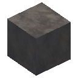

一个受激光力影响的刚体钢块，能够反射激光。

### 冰块

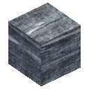

一个不会被激光影响的刚体冰块。

### 双向挡板\_A

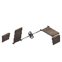

和官方 `双向挡板_A` 相同，但受到激光力的影响。

### 双向挡板\_B

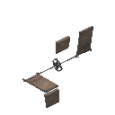

和官方 `双向挡板_B` 相同，但受到激光力的影响。

### 栅栏

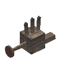

和官方栅栏相同，但受到激光力的影响。

### 推板

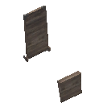

和官方推板相同，但受到激光力的影响。

### T 板

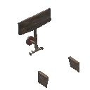

和官方 T 板相同，但受到激光力的影响。

### 钢板

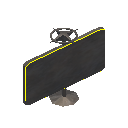

一个可旋转的钢板，可以反射激光。

### TNT

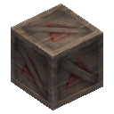

和官方 TNT 基本相同（不能和官方机关交互，比如炸断软木桥），当被激光照射、受到强力冲击或者被高温玩家球触碰后爆炸。

#### 配置

| 变量名                  |  类型   |  默认值  | 描述                                                 |
| ----------------------- | :-----: | :------: | :--------------------------------------------------- |
| `explodeImpulseRequire` |  float  |    5     | 使 TNT 爆炸所需的最小冲量。                          |
| `explodeTempRequire`    |  float  |   200    | 使 TNT 爆炸所需的最小温度。                          |
| `explodeForce`          |  float  |    30    | 施加到爆炸 TNT 附近物体的力。                        |
| `range`                 |  float  |    5     | 爆炸的范围。在该半径范围内的物体都会受到爆炸的影响。 |
| `damageTable`           | float[] | _见下表_ | 当玩家被 TNT 炸到时所受的伤害。                      |

#### 伤害表

玩家受到的伤害取决于玩家球的种类。

| 索引 | 对应球种 | 默认值 |
| :--: | :------: | :----: |
|  0   |   木球   |   10   |
|  1   |   石球   |   5    |
|  2   |  纸冰球  |   15   |
|  4   |   钢球   |  2.5   |
|  5   |  橡胶球  |   8    |
|  6   |   气球   |  100   |
|  7   |   粘球   |   15   |
|  8   |  海绵球  |   0    |
|  9   |   其他   |   10   |

### 激光门

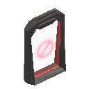

和 Ballex1 中的官方 `激光门` 相同。

#### 配置

在 `设置` 组件中，`标签` 数组的第一个元素表示当激光门被激光照射后开启的持续时间（单位为帧），默认为 `100`。

### 激光门\_关节

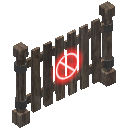

该门在受到激光照射后会永久开启。

> [!TIP]
> 你可以在 `Door_Left` 和 `Door_Right` 子物体上添加 `AffectedByLaserForce` 标签来使门受到激光力的影响。

#### 配置

如果 `ResetOnDeath` 标签在 `标签` 数组中，则玩家死亡后激光门会被重新锁定。否则，它将保持解锁状态（如果它之前被解锁过）。

### 被激光摧毁

一个可以被激光摧毁的模板元件。
你可以在 `音频播放器` 组件中设置其摧毁音效。

### 激光

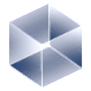

一个纯粹的激光，可以发射激光光束。

#### 配置

| 变量名               |      类型      |        默认值         | 描述                                                                                                 |
| -------------------- | :------------: | :-------------------: | :--------------------------------------------------------------------------------------------------- |
| `endPosOffsets`      |    Float3[]    | [{x: 0, y: 0, z: 30}] | 每个 Float3 代表一束激光。激光的方向和最大行进距离取决于 Float3 的方向和长度。                       |
| `force`              | [float, float] |       [0.5, 1]        | 施加到拥有 `AffectedByLaserForce` 标签的 **刚体** 元件上的线性（第一个元素）和角度（第二个元素）力。 |
| `damageTable`        |    float[]     |       _见下表_        | 如果玩家被激光击中，每帧所受的伤害。                                                                 |
| `heatFactor`         |     float      |           2           | 如果玩家被激光击中，每帧所增加的温度。                                                               |
| `chargeFactor`       |     float      |          0.5          | 如果玩家被激光击中，每帧所增加的电力。                                                               |
| `dryFactor`          |     float      |          0.5          | 如果玩家被激光击中，每帧所减少的湿度。                                                               |
| `material`           | AssetReference |  SwitcherGlow_Purple  | 激光光束的材质。                                                                                     |
| `thickness`          |     float      |           1           | 激光光束的厚度因子。                                                                                 |
| `stopUpdateDistance` |     float      |          50           | 如果激光和玩家之间的距离大于这个值，激光将停止更新。如果值为负，激光将始终更新。_用于优化性能_       |
| `halfSample`         |      bool      |         true          | 如果为真，激光将每隔一帧更新一次。_用于优化性能_                                                     |
| `asRepeater`         |      bool      |         false         | 如果为真，除非激光本身被激光光束击中，否则激光将不会发射光束。                                       |
| `bake`               |      bool      |         false         | 如果为真，激光将会被提前烘焙，在游玩过程中不再实时更新或影响其他元件。_用于装饰_                     |

#### 伤害表

玩家受到的伤害取决于玩家球的种类。

| 索引 | 对应球种 | 默认值 |
| :--: | :------: | :----: |
|  0   |   木球   |  0.3   |
|  1   |   石球   |  0.1   |
|  2   |   纸球   |  100   |
|  3   |   冰球   |   0    |
|  4   |   钢球   | 0.025  |
|  5   |  橡胶球  |  0.3   |
|  6   |   气球   |  100   |
|  7   |   粘球   | 0.125  |
|  8   |  海绵球  |   0    |
|  9   |   其他   |  0.25  |

### 激光\_静态

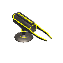

一个静态激光，朝其坐标系内的正 z 轴发射激光光束。
你可以在 `Laser_Head` 子物体中配置激光。

### 激光\_旋转

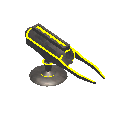

和 `激光_静态` 相同，但始终绕其自身 y 轴旋转。

#### 配置

| 变量名        | 类型  | 默认值 | 描述                       |
| ------------- | :---: | :----: | :------------------------- |
| `rotateSpeed` | float |  0.25  | 旋转速度，单位为角度每帧。 |

### 激光\_可旋转

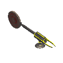

和 `激光_静态` 相同，但可以旋转。

### 激光\_可旋转\_短推靶

和 `激光_可旋转` 相同，但拥有较短的推靶。

### 激光\_双头

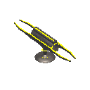

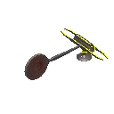
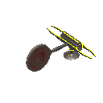

激光的双头版本。它们朝其坐标系内的正 z 轴和负 z 轴发射激光光束。

### 中继器

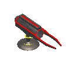

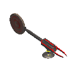
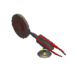

激光的中继器版本。

### 分束器

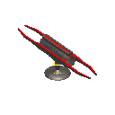

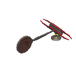
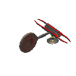

双头激光的中继器版本。

#### 特性

`自补给` : 如果中继器被自身的激光击中，它也将发射激光光束。

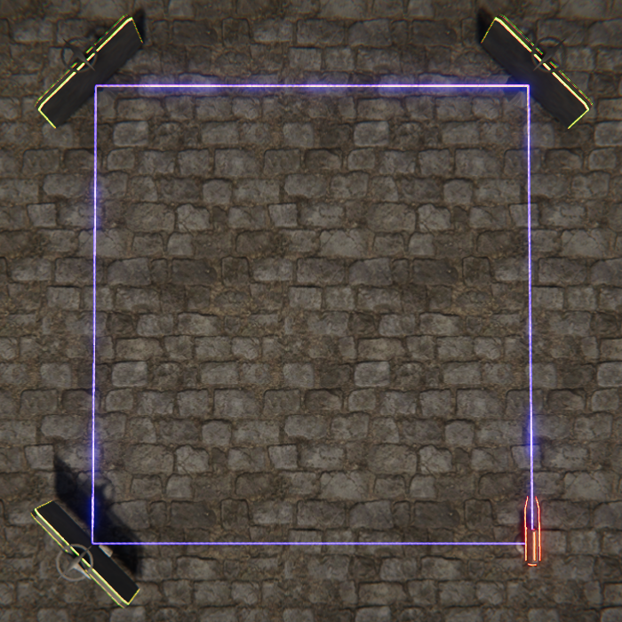

## 注意

-   激光元件对性能要求非常高，请谨慎使用。
-   不要过度使用 `激光_旋转`。静态激光有缓存机制以确保其性能，但始终旋转的激光无法享受这一机制。
-   不要让激光过度反射。反射的性能消耗非常高。
-   在同一小节内推荐布置不超过四个激光，否则性能可能会大幅下降。
-   尽量拉远拥有激光的小节之间的距离，这样前面小节的激光将不再被更新（如果 `stopUpdateDistance` 设置为了正值），以优化性能。

## 许可协议

该资源包基于 [MIT](https://github.com/Withered-Flower-0422/Laser/blob/main/LICENSE) 许可发布。
